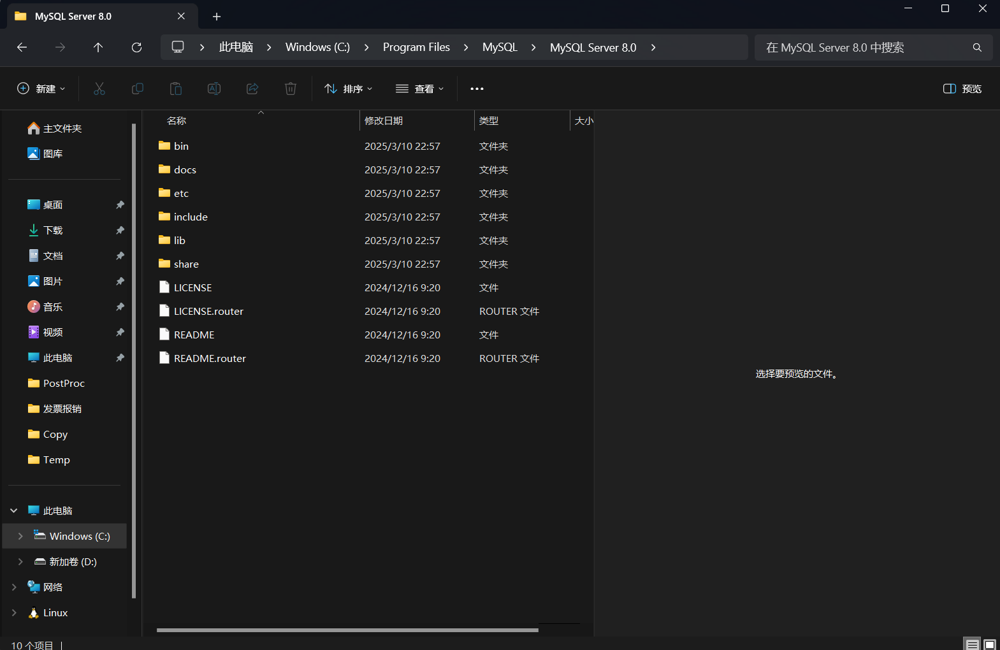

[[toc]]
#### mysql服务无法启动 服务没有报告任何错误 解决方法
1.查看C:\Windows\System32\drivers\etc\hosts 文件，localhost地址有无修改

2.安装路径下若没有my.ini文件，可在安装路径下新建一个my.ini文件，内容如下：
```
[mysql]
default-character-set=utf8
[mysqld]
port=3306
basedir=D:\Program Files\MySQL\MySQL Server 8.0
datadir=D:\Program Files\MySQL\MySQL Server 8.0\data
max_connections=200
character-set-server=utf8
default-storage-engine=INNODB
```


若手动创建可能出错

3.初始化MySQL服务  
进入bin目录，输入  
```
mysqld --initialize-insecure
```
再输入
``` net start mysql```  
启动服务
